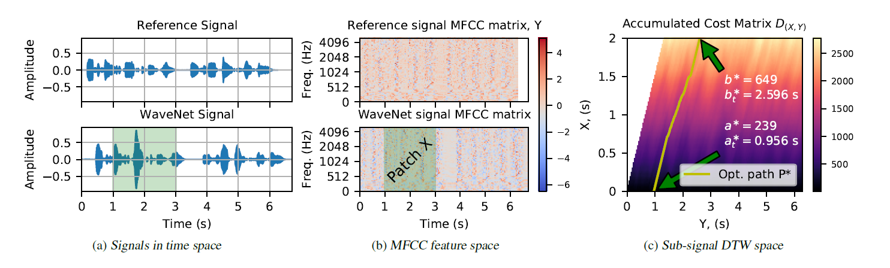

# WARP-Q Speech Quality Metric
This code is to run the WARP-Q speech quality metric.

https://github.com/WissamJassim/WARP-Q.git

WARP-Q (Quality Prediction For Generative Neural Speech Codecs) is an objective, full-reference metric for perceived speech quality. It uses a subsequence dynamic time warping (SDTW) algorithm as a similarity between a reference (original) and a test (degraded) speech signal to produce a raw quality score. It is designed to predict quality scores for speech signals processed by low bit rate speech coders. 

# General Description

Speech coding has been shown to achieve good speech quality using either waveform matching or parametric reconstruction. For very low bit rate streams, recently developed generative speech models can reconstruct high quality wideband speech from the bit streams of standard parametric encoders at less than 3 kb/s. Generative codecs produce high quality speech based on synthesising speech from a DNN and the parametric input. 

The problem is that the existing objective speech quality models (e.g., ViSQOL, POLQA) cannot be used to accurately evaluate the quality of coded speech from generative models as they penalise based on signal differences not apparent in subjective listening test results. Motivated by this observation, we propose the WARP-Q metric, which is robust to low perceptual signal changes introduced by low bit rate neural vocoders. Figure 1 shows illustrates a block diagram of the proposed algorithm.    

|  | 
|:--| 
| Figure 1: Blockgiagram of WARP-Q metric |

The algorithm of WARP-Q metric consists of four processing stages:  

- Pre-processing: silent non-speech segments from reference and degraded signals are detected and removed using a voice activity detection (VAD) algorithm. 

- Feature extraction: Mel frequency cepstral coefficients (MFCCs) representations of the reference and degraded signals are first generated. The obtained MFCCs representations are then normalised so that they have the same segmental statistics (zero mean and unit variance) using the cepstral mean and variance normalisation (CMVN). 

- Similarity comparison: WARP-Q uses the SDTW algorithm to estimate the similarity between the reference degraded signals in the MFCC domain. It first divides the normalised MFCCs of the degraded signal into a number, , of patches. For each degraded patch , the SDTW algorithm then computes the accumulated alignment cost between  and the reference MFCC matrix . The computation of accumulated alignment cost is based on an accumulated alignment cost matrix  and its optimal path  between  and . Figure 2 shows an example of this stage. Further details are available in [1].   

|  | 
|:--| 
| Figure 2: SDTW-based accumulated cost and optimal path between two signals. (a) plots of a reference signal and its corresponding coded version from a WaveNet coder at 6 kb/s (obtained from the VAD stage), (b) normalised MFCC matrices of the two signals, (c) plots of SDTW-based accumulated alignment cost matrix  and its optimal path  between the MFCC matrix  of the reference signal and a patch  extracted from the MFCC matrix of the degraded signal. The optimal indices (  and   ) are also shown.  corresponds to a short segment (2 s long) from the WaveNet signal (highlighted in green color). |

- Subsequence score aggregation: the final quality score is representd by a median value of all alignment costs. 

An evaluation using waveform matching, parametric and generative neural vocoder based codecs as well as channel and environmental noise shows that WARP-Q has better correlation and codec quality ranking for novel codecs compared to traditional metrics as well as the versatility of capturing other types of degradations, such as additive noise and transmission channel degradations. 

The results show that although WARP-Q is a simple model building on well established speech signal processing features and algorithms it solves the unmet need of a speech quality model that can be applied to generative neural codecs.

# Requirements
Run using python 3.x and include these package dependencies in your virtual environment:

    - pandas 
    - librosa
    - seaborn 
    - numpy 
    - scipy
    - pyvad
    - skimage
    - speechpy
    - soundfile 

# Run WARPQ_main_code.py

Input:

    - The main_test function calls a csv file that contains paths of audio files. 
    
    - The csv file cosists of four columns: 
    
        - Ref_Wave: reference speech
        
        - Test_Wave: test speech
        
        - MOS: subjective score (optinal, for plotting only)
        
        - Codec: type of speech codec for the test speech (optinal, for plotting only)
        
    
Output: 

    - Code will compute the WARP-Q quality scores between Ref_Wave and Test_Wave. 
    It will then store the obrained results in a new column in the same csv file.  

# Papers for citation

Design of the WARP-Q algorithm is described in detail in the following paper: 

[1] W. A. Jassim, J. Skoglund, M. Chinen, and A. Hines, “WARP-Q: Quality prediction for generative neural speech codecs,” paper accepted for presenatation at the 2021 IEEE International Conference on Acoustics, Speech and Signal Processing (ICASSP 2021). Date of acceptance: 30 Jan 2021
