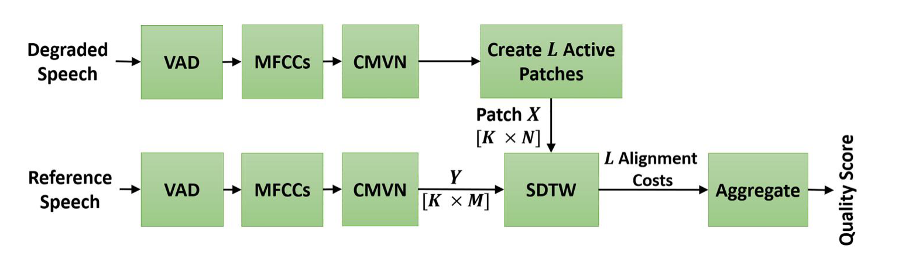
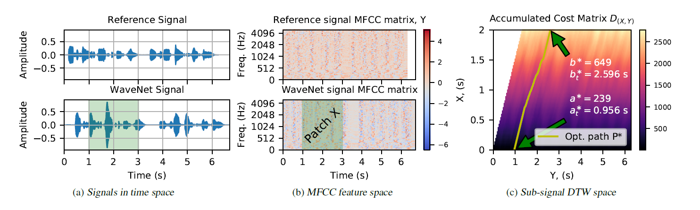

# WARP-Q: Speech Quality Prediction For Generative Neural Speech Codecs

***Note: In October 2024, we released a new API for the code. The initial versions are preserved and archived in a separate folder for reference and continued use if needed. You can find the archived initial code versions [here](https://github.com/wjassim/WARP-Q/tree/main/legacy_code).***

---

A Python package for running **WARP-Q**, a full-reference metric for predicting speech quality in generative neural speech codecs.

WARP-Q is a Python library designed to evaluate the quality of modern generative neural speech codecs and traditional low bit-rate speech coders. It uses a subsequence dynamic time warping (SDTW) algorithm to measure the similarity between a reference (original) and a test (degraded) speech signal, producing raw and normalized quality scores.

- [News](#news)
- [Overview](#overview)
- [Installation](#installation)
- [Usage](#usage)
  - [Importing the Package](#1-importing-the-package)
  - [Evaluating Quality of Two Audio Files](#2-evaluating-quality-of-two-audio-files)
  - [Save detailed results to a CSV file](#3-save-detailed-results-to-a-csv-file)
  - [Evaluate Two Audio Arrays](#4-evaluate-two-audio-arrays)
  - [Evaluate Batches of Files From CSV Inputs](#5-evaluate-batches-of-files-from-csv-inputs)
  - [Visualizing WARP-Q Scores Using the `plot_warpq_scores` Function](#6-visualizing-warp-q-scores-using-the-plot_warpq_scores-function)
  - [Plotting Scores Grouped by Condition or Degradation Type](#7-plotting-scores-grouped-by-condition-or-degradation-type)
  - [WARP-Q Score Normalization](#8-warp-q-score-normalization)
  - [Plot Examples: MOS vs. WARP-Q Scores](#plot-examples-mos-vs-warp-q-scores)
- [Citing](#citing)


## News
- October 2024: We launched a new API for the WARP-Q model on `PyPI`, with several key improvements:
  - **Efficient Computation**: Compute WARP-Q scores for single or batch audio files via CSV inputs.
  - **Flexible SDTW Parameters**: Customize Soft Dynamic Time Warping (SDTW) settings.
  - **Alignment Indices**: Get time and frame indices for aligned audio segments.
  - **Score Normalization**: Normalize WARP-Q scores for consistent evaluation.
  - **Detailed Results**: Save results in DataFrames for analysis.
  - **Utility Functions**: Plot results, aggregate data, and load audio files.
  - **Accelerated Processing**: Support for parallel processing to speed up computations.

- November 2022: Adding a new API with two running modes via command line arguments and different pretrained mapping models. Examples of how to use the code are also included. 
- July 2022: A new manuscript entitled [“Speech quality assessmentwith WARP‐Q: From similarity to subsequence dynamic time warp cost”](https://ietresearch.onlinelibrary.wiley.com/doi/epdf/10.1049/sil2.12151) has been accepted for publication in the IET Signal Processing Journal. In this paper, we present the detailed design of WARP-Q with a comprehensive evaluation and analysis of the model components, design decisions, and salience of parameters to the model's performance. The paper also presents a comprehensive set of benchmarks with standard and new datasets and benchmarks against other standard and state-of-the-art full reference speech quality metrics. Furthermore, we compared WARP-Q results to the results from two state-of-the-art reference free speech quality measures. We also explored the possibility of mapping raw WAPR-Q scores onto target MOS using different machine learning (ML) models.

- Jan 2021: Publishing initial codes of WARP-Q.

## Overview

Speech coding has been shown to achieve good speech quality using either waveform matching or parametric reconstruction. For very low bit rate streams, recently developed generative speech models can reconstruct high quality wideband speech from the bit streams of standard parametric encoders at less than 3 kb/s. Generative codecs produce high quality speech based on synthesising speech from a DNN and the parametric input. 

The problem is that the existing objective speech quality models (e.g., ViSQOL, POLQA) cannot be used to accurately evaluate the quality of coded speech from generative models as they penalise based on signal differences not apparent in subjective listening test results. Motivated by this observation, we propose the WARP-Q metric, which is robust to low perceptual signal changes introduced by low bit rate neural vocoders. Figure 1 illustrates a high‐level block diagram of the WARP‐Q metric.

<br>
<div align="center">
 
</div>
<div style="max-width: 800px; text-align: left; margin: 0 auto;">
<em>Figure 1: Block diagram of the WARP-Q metric.</em>
</div>
<br>
The algorithm of WARP-Q metric consists of four processing stages:  

- **Pre-processing**: silent non-speech segments from reference and degraded signals are detected and removed using a voice activity detection (VAD) algorithm. 

- **Feature extraction**: the Mel-frequency cepstral coefficients (MFCC) of the reference and degraded signals are first generated. The obtained MFCCs representations are then normalised so that they have the same segmental statistics (zero mean and unit variance) using the cepstral mean and variance normalisation (CMVN). 

- **Similarity comparison**: WARP-Q employs the Subsequence Dynamic Time Warping (SDTW) algorithm to assess the similarity between reference and degraded signals in the MFCC domain [[1]](https://ietresearch.onlinelibrary.wiley.com/doi/epdf/10.1049/sil2.12151), [[2]](https://arxiv.org/pdf/2102.10449). Figure 2 shows an example for this process which involves:

  1. Dividing the normalized MFCCs of the degraded signal into $L$ patches.
  2. For each degraded patch $X$, computing the SDTW alignment cost between $X$ and the reference MFCC matrix $Y$.
  3. Calculating the accumulated alignment cost matrix $D_{(X,Y)}$ and determining its optimal path $P^\ast$ between $X$ and $Y$. 

  <br>
<div align="center">
  
</div>
<div style="max-width: 1000px; text-align: left; margin: 0 auto;">
  <em>Figure 2: (a) Waveforms of a reference signal and its WaveNet-coded version at 6 kb/s (post-VAD), 
  (b) normalised MFCC matrices of the two signals, (c) SDTW-based accumulated alignment cost matrix 
  <code>D<sub>(X,Y)</sub></code> and optimal path <code>P<sup>*</sup></code> between the reference 
  MFCC matrix <code>Y</code> and a 2-second patch <code>X</code> from the coded signal's MFCC matrix 
  (highlighted in green). Optimal indices <code>a<sup>*</sup></code> and 
  <code>b<sup>*</sup></code> are indicated.</em>
</div>

<br>

- **Subsequence score aggregation**: the final quality score is representd by a median value of all alignment costs. 

An evaluation using waveform matching, parametric and generative neural vocoder based codecs as well as channel and environmental noise shows that WARP-Q has better correlation and codec quality ranking for novel codecs compared to traditional metrics as well as the versatility of capturing other types of degradations, such as additive noise and transmission channel degradations. The results show that although WARP-Q is a simple model building on well established speech signal processing features and algorithms it solves the unmet need of a speech quality model that can be applied to generative neural codecs.


## Installation
<!-- Currently, you can install the WARP-Q metric from **TestPyPI** using the following command: -->

You can install WARP-Q directly from **PyPI**: 

```bash
pip install warpq   
```
<!-- pip install warpq --extra-index-url=https://test.pypi.org/simple/ -->
<!--
Once WARP-Q is available on the **official PyPI** repository, you will be able to install it directly with:
```bash
pip install warpq   
```
-->

## Usage
### 1. Importing the Package
Once installed, you can import the `WARP-Q` metric class:

```python
from warpq.core import warpqMetric
```
You can also import utility functions:
```python
from warpq.utils import load_audio, plot_warpq_scores, group_dataframe_by_columns 
```
To create an instance of the `warpqMetric` class and initialize the model with default parameters, we run:
```python
# Create an instance of the warpqMetric class
model = warpqMetric()
```
Loading the `warpqMetric` object will create an instance of the class with the following parameters:

- **`sr`**: `int` (default: `16000`): Sampling frequency of audio signals in Hertz (Hz).

- **`frame_ms`**: `int` (default: `32`): Length of audio frame in milliseconds for framing.

- **`overlap_ms`**: `int` (default: `4`): Length of overlap between consecutive frames in milliseconds.

- **`n_mfcc`**: `int` (default: `13`): Number of Mel-Frequency Cepstral Coefficients to compute.

- **`fmax`**: `int` (default: `5000`): Cutoff frequency for MFCC computation.

- **`patch_size`**: `float` (default: `0.4`): Size of each patch in seconds for processing.

- **`patch_hop`**: `float` (default: `0.2`): Hop size between patches in seconds.

- **`sigma`**: `list` (default: `[[1, 0], [0, 3], [1, 3]]`): Step size conditions for Subsequence Dynamic Time Warping (SDTW).

- **`apply_vad`**: `bool` (default: `True`): Flag to determine if Voice Activity Detection (VAD) should be applied.

- **`score_fn`**: `str` (default: `'median'`): Function to compute the final score. Options are `'mean'` or `'median'`.

- **`cmvnw_win_time`**: `float` (default: `0.836`): The size of the sliding window for local normalization (in seconds).

- **`max_score`**: `float` (default: `3.5`): Maximum raw score for normalization.

- **`n_jobs`**: `int` (default: `-1`): Number of cores to use for parallel processing. If `None` or `-1`, all available cores will be used.

We can also call the `warpqMetric` class with customized parameters. For example:

```python
# Initialize the class with custom parameters
model = warpqMetric(sr=8000, frame_ms=25, overlap_ms=10)
```
This allows you to set custom values for parameters such as the sampling rate (`sr`), frame length (`frame_ms`), and overlap between frames (`overlap_ms`), among others.

### 2. Evaluating Quality of Two Audio Files

The `evaluate()` function from the `warpqMetric` class computes the WARP-Q score between two input speech signals, which can either be audio file paths or audio arrays. This function provides detailed alignment information, including the degree of similarity between the reference and degraded audio using the WARP-Q metric.

#### Inputs:
- **`ref_audio`** (`str` or `np.ndarray`): Path to the reference audio file or a NumPy array of the reference audio signal.
- **`deg_audio`** (`str` or `np.ndarray`): Path to the degraded audio file or a NumPy array of the degraded audio signal.
- **`arr_sr`** (`int`, optional): Sampling rate, required only if providing audio arrays.
- **`save_csv_path`** (`str`, optional): Path to save the detailed results in a CSV file. If `None`, results are not saved. If a valid path is provided, the results will be saved in CSV format, with columns including reference and degraded audio descriptions, WARP-Q scores, alignment costs, and timing information for each patch. If the file already exists, new results will be appended without the header.
- **`verbose`** (`bool`, optional): If `True`, outputs messages about the processing.

#### Outputs:
The `evaluate()` function returns a dictionary (`dict`) containing the WARP-Q results and detailed alignment information, including:

  - **`raw_warpq_score`** (`float`): The computed WARP-Q score between the reference and degraded audio.

  - **`normalized_warpq_score`** (`float`): The normalized WARP-Q score between `0` and `1`, where `1` indicates the best audio quality. Please see the normalization section below for more details.

  - **`total_patch_count`** (`int`): The total number of patches generated from the degraded signal's MFCC, representing the number of segments in the degraded signal after applying the sliding window.

  - **`alignment_costs`** (`list`): A list of DTW alignment costs for each degraded MFCC patch, representing how well each patch matches its aligned subsequence in the reference MFCC. Length is equal to `total_patch_count`.

  - **`aligned_ref_time_ranges`** (`list`): List of (start_time, end_time) tuples containing the start and end time stamps (in seconds) for the best matching subsequences in the reference MFCC, as aligned to each patch in the degraded signal using DTW. Length is equal to `total_patch_count`.

  - **`aligned_ref_frame_indices`** (`list`): List of (`a_ast`, `b_ast`) tuples containing the start and end frame indices for the best matching subsequences in the reference MFCC, corresponding to the aligned subsequences. Length is equal to `total_patch_count`.

  - **`deg_patch_time_ranges`** (`list`): List of (start_time, end_time) tuples containing the start and end time stamps (in seconds) for each patch in the degraded signal's MFCC, generated using a sliding window approach. Length is equal to `total_patch_count`.

  - **`deg_patch_frame_indices`** (`list`): List of (start_frame, end_frame) tuples containing the start and end frame indices for each patch in the degraded signal's MFCC, corresponding to the patches created by the sliding window process. Length is equal to `total_patch_count`.


#### Example Usage:
You can compute the WARP-Q score between two audio files (reference and degraded) as follows:

```python
# Create an instance of the warpqMetric class
model = warpqMetric()

# Evaluate the audio quality between two files
results = model.evaluate('audio/ref_audio.wav', 'audio/deg_audio.wav', verbose=True)

# Access the raw WARP-Q and normalized scores
raw_warpq_score = results["raw_warpq_score"]
normalized_warpq_score = results["normalized_warpq_score"]

# Print the results
print(f"Raw WARP-Q Score: {raw_warpq_score}")
print(f"Normalized WARP-Q Score: {normalized_warpq_score}")
```
### 3. Save detailed results to a CSV file
It is possible to save the results obtained from the `model.evaluate` function to a CSV file for further analysis. This can be done by setting the parameter `save_csv_path` to the desired file path:

```python
results = model.evaluate('audio/ref_audio.wav', 'audio/deg_audio.wav', save_csv_path="csv/results.csv", verbose=True)
```
Below is an example of a few rows from the saved CSV file:
<!--

-->

<p align="center">
  <a href="https://github.com/wjassim/WARP-Q/raw/main/Resources/images/detailed_results_example.png" target="_blank">
    
  </a>
</p>


### 4. Evaluate Two Audio Arrays
You can load audio files using the `load_audio` function and pass the audio data to the `model.evaluation` function as shown in the following example:

```python
# Load the reference and degraded audio files
ref_arr, deg_arr, ref_sr, deg_sr = load_audio(ref_path="audio/ref_audio.wav", deg_path="audio/deg_audio.wav", sr=16000, native_sr=False, verbose=True)

# Run the model using the loaded audio arrays
results = model.evaluate(ref_arr, deg_arr, arr_sr=ref_sr)
```
Note that the value passed to the `arr_sr` parameter should match the class-defined sampling rate `self.sr`.


### 5. Evaluate Batches of Files From CSV Inputs

The `evaluate_from_csv` from the `warpqMetric` class allows you to compute the WARP-Q scores for multiple audio files listed in a CSV file. This is useful when you need to evaluate the quality of audio for a large number of file pairs (reference and degraded).

The `evaluate_from_csv` function takes the following inputs:

- **`input_csv`** (`str`): Path to a CSV file with specified reference and degraded wave columns.
- **`ref_wave_col`** (`str`): Name of the reference wave column. Default is `'ref_wave'`.
- **`deg_wave_col`** (`str`): Name of the degraded wave column. Default is `'deg_wave'`.
- **`raw_score_col`** (`str`): Column name where raw scores will be saved. Default is `'Raw WARP-Q Score'`.
- **`output_csv`** (`str`): Path to save results. If `None`, results are not saved.
- **`save_details`** (`bool`): If `True`, save detailed results (alignment costs, times) in the same DataFrame.

and it returns the following:
- `pd.DataFrame`: DataFrame with computed WARP-Q scores and detailed results if requested.

- Additional detailed results (saved when `save_details=True`) include:
  - **`total_patch_count`** (`int`): The total number of patches in the degraded signal.
  - **`alignment_costs`** (`list`): The alignment costs for each patch between the degraded and reference signals. 
  - **`deg_patch_time_ranges`** (`list`): List of tuples for (start, end) times in seconds of each patch in the degraded signal. 
  - **`aligned_ref_time_ranges`** (`list`): List of tupes for (start, end) times in seconds of the aligned segments in the reference signal. 


#### Preparing the Input CSV File: 
To use this function, first, you need to prepare a CSV file with columns specifying the reference and degraded audio files. The CSV file must contain at least the following two columns:

- **`ref_wave`**: Column containing paths to the reference audio files.
- **`deg_wave`**: Column containing paths to the degraded audio files.

You may optionally include additional columns, such as Mean Opinion Score (MOS), degradation type, condition (experiment), and database for each file, if such information is accessible. These columns can facilitate further analysis, such as plotting WARP-Q scores against MOS or evaluating performance based on degradation types or experimental conditions.

An example of the CSV file:

<div style="overflow-x: auto;">

| database | ref_wave        | deg_wave         | condition | degradation_type | MOS  |
|----------|-----------------|------------------|-----------|------------------|------|
| set1     | ref_audio_1.wav | deg_audio_1.wav  | condA     | noise            | 4.5  |
| set2     | ref_audio_2.wav | deg_audio_2.wav  | condB     | reverb           | 3.8  |
| set3     | ref_audio_3.wav | deg_audio_3.wav  | condC     | echo           | 4.1 |
| set4    | ref_audio_4.wav | deg_audio_4.wav  | condD     | clipping           | 4.3  |

</div>

You can optionally add more columns, but the function will primarily rely on the `ref_wave` and `deg_wave` columns for evaluating the audio quality.

#### Example Usage

```python
results_df = model.evaluate_from_csv(
            input_csv="audio_files.csv",
            ref_wave_col="ref_wave",
            deg_wave_col="deg_wave",
            raw_score_col="WARP-Q score",
            output_csv="results_df.csv",
            save_details=True
            )
```

Note that audio files with short durations are skipped in the computation, and their results are replaced with `np.nan`. Below is an example of how the results from the `evaluate_from_csv` function might look when saved to a CSV file. 

<p align="center">
  <a href="https://github.com/wjassim/WARP-Q/raw/main/Resources/images/evaluate_from_csv_results_example.png" target="_blank">
    
  </a>
</p>

The `alignment_costs`, `deg_patch_time_ranges`, and `aligned_ref_time_ranges` lists are saved as strings in the CSV file. To convert these strings back to Python lists, you can use `ast.literal_eval`:

```python
import ast
import pandas as pd
import numpy as np

# Load the CSV file
df_loaded = pd.read_csv('results_df.csv')

# Convert the string back to lists, handling NaN values
df_loaded['alignment_costs'] = df_loaded['alignment_costs'].apply(lambda x: ast.literal_eval(x) if pd.notna(x) else np.nan)

print(df_loaded)
```

### 6. Visualizing WARP-Q Scores Using the `plot_warpq_scores` Function

The `plot_warpq_scores` function generates a scatter plot of MOS versus WARP-Q scores and calculates the Pearson and Spearman correlation coefficients. The function supports color encoding and marker styling based on categories such as `condition` or `degradation_type` to enhance the plot's clarity.

#### Parameters:
- **`df`**: A `pandas` DataFrame or path to a CSV file containing MOS and WARP-Q scores.
- **`mos_col`**: The column name for the `MOS`.
- **`warpq_col`**: The column name for WARP-Q scores. Default is `"Raw WARP-Q Score"`.
- **`hue_col`**: Optional. A column name used to color the points by category (e.g., `condition` or `degradation_type`).
- **`style_col`**: Optional. A column name to differentiate marker styles in the scatter plot.
- **`save_path`**: Optional. The path to save the plot as a `.png` file. The `.png` extension will be added if not provided.

By default, the function plots MOS and WARP-Q scores for each audio file in the dataset, allowing you to directly assess the relationship between subjective and objective quality metrics.


#### Example Usage (Plotting for Individual Files):
```python
warp_plot = model.plot_warpq_scores(
    df="results_df.csv",          # Path to CSV containing MOS and WARP-Q scores for each audio file (e.g., obtained from the model.evaluate_from_csv function)
    mos_col="MOS",                # Column containing MOS
    warpq_col="WARP-Q score", # Column containing WARP-Q scores
    # warpq_col="Normalized WARP-Q score", # or plot the normalized quality scores
    title="MOS vs WARP-Q for Individual Files",
    save_path="mos_vs_warpq_individual.png"
)
```
This example generates a scatter plot comparing MOS and WARP-Q scores for each individual audio file. The plot is saved as `mos_vs_warpq_individual.png`.

### 7. Plotting Scores Grouped by Condition or Degradation Type
In addition to plotting scores for individual files, it is often insightful to group the data by specific conditions such as degradation type, experiment condition, database or codec. Grouping scores can help you better understand how different types of degradation impact audio quality and assess the overall performance of a codec or processing technique across multiple conditions.

To achieve this, you can first group the data using the `group_dataframe_by_columns` function, and then plot the aggregated results.

#### Parameters:
- **`data`**: A `pandas` DataFrame to group. If not provided, data can be loaded from a CSV via `csv_path`.
- **`csv_path`**: Path to a CSV file to load data from if no DataFrame is provided.
- **`group_cols`**: A list of columns to group by (e.g., `["Degradation Type", "Condition"]`).
- **`agg_cols`**: A list of columns to apply the aggregation function to (e.g., `["MOS", "Raw WARP-Q Score"]`).
- **`agg_func`**: The aggregation function to apply. Default is `"mean"`, but you can also apply other functions like `"sum`", `"min`", `"max`", etc..
- **`output_csv`**: Optional. Path to save the grouped data as a CSV file.

#### Example Usage (Grouping Data by Degradation Type and Plotting):

```python
# Group data by Degradation Type and calculate the mean MOS and WARP-Q scores for each group
grouped_df = model.group_dataframe_by_columns(
    csv_path="results_df.csv",        # Path to the CSV file
    group_cols=["degradation_type"],  # Grouping by degradation type
    agg_cols=["MOS", "WARP-Q score", 'Normalized WARP-Q score'],  # Columns to aggregate
    agg_func="mean",                  # Aggregating by mean values
    output_csv="grouped_by_degradation.csv"  # Save grouped data to a new CSV
)

# Plot the grouped data
warp_plot = model.plot_warpq_scores(
    df="grouped_by_degradation.csv",  # Use the grouped data
    mos_col="MOS",                    # Column containing aggregated MOS
    warpq_col="WARP-Q score",     # Column containing aggregated WARP-Q scores
    # warpq_col="Normalized WARP-Q score", # or plot the normalized quality scores
    hue_col="degradation_type",       # Color points by degradation type
    title="MOS vs WARP-Q by Degradation Type",
    #title="MOS vs normalized WARP-Q by Degradation Type",
    save_path="mos_vs_warpq_degradation.png"
)
```

### 8. WARP-Q Score Normalization
The WARP-Q metric provides raw scores that exhibit a **negative correlation** with quality. This means that **lower values (closer to zero) indicate higher quality, while higher scores reflect lower quality**. This behavior arises because WARP-Q is based on the alignment cost between the reference and degraded speech signals.

#### Why Alignment Cost Gives Negative Quality Score Correlation?:
The alignment cost is calculated using Subsequence Dynamic Time Warping (SDTW), which measures how well the degraded speech aligns with the reference speech over time. When the alignment cost is low, it indicates that the codec or degradation type has preserved the speech signal well, resulting in higher quality. Conversely, a high alignment cost suggests more distortion, meaning the signal quality has deteriorated.

#### Normalization Process:
To present WARP-Q scores with **positive correlation** (where higher scores indicate better quality), we normalize the raw WARP-Q scores to a **0 to 1 scale**. The normalization is performed using the following equation:

$$
\text{Normalized WARP-Q Score} = 1 - \left(\frac{\text{Raw WARP-Q Score}}{\text{Max WARP-Q Score}}\right),
$$

where:
- `Raw WARP-Q Score` is the score produced by the WARP-Q metric (based on subsequence DTW alignment cost).
- `Max WARP-Q Score` is a predefined maximum score used for normalization.

The `Max WARP-Q Score` is set to **`3.5`** based on evaluations across four different databases that are used in our papers. This value ensures that the normalized scores range from `0` to `1` with positive correlation to quality.

#### Handling Scores That Exceed the Max Score:

If the `Max WARP-Q Score` is set too low, the normalization term $\left(\frac{\text{Raw WARP-Q Score}}{\text{Max WARP-Q Score}}\right)$ can result in values greater than `1`. In such cases, the normalized score $\left(1 - \left(\frac{\text{Raw WARP-Q Score}}{\text{Max WARP-Q Score}}\right)\right)$ becomes less than zero. To prevent this, the WARP-Q implementation clips all negative scores to `0`.

Therefore, if you notice **many scores are zero**, this likely indicates that the `Max WARP-Q Score` is too low for your dataset or codec, and you may need to adjust it.

#### Adjusting the Max Score:

You can adjust the `Max WARP-Q Score` to better fit your specific use case or database. To do this, pass the desired maximum value when creating an instance of the WARP-Q class:

```python
model = warpqMetric(max_score=your_desired_max_score)
```

This allows you to fine-tune the normalization process according to the characteristics of your dataset and codec performance, ensuring better alignment with subjective quality assessments.

#### Normalizing to a 1-to-5 Scale: 
It is possible to normalize the raw WARP-Q score to align with the Mean Opinion Score (MOS), which typically ranges from `1` to `5`. The normalization for this would be:


$$
\text{Normalized WARP-Q Score} (1-5) = 1 + 4 \times \left(1 - \frac{\text{Raw WARP-Q Score}}{\text{Max WARP-Q Score}}\right),
$$


where:
- A score of `1` indicates low quality,
- A score of `5` indicates high quality.

In the current implementation, we are scaling the scores to the `0` to `1` range to keep things simple. A more robust mapping model based on machine learning algorithms is under development. It will be released soon and will provide better correlations with the subjective quality scores. Such a model can handle various distortion and coding scenarios more effectively.


## 9. Plot Examples: MOS vs. WARP-Q Scores
The following plots demonstrate the relationship between MOS and WARP-Q scores, both before and after normalization. In the normalized plots, the WARP-Q scores are scaled from 0 to 1. These examples cover two cases:

- Per Audio File: This shows the alignment between MOS and WARP-Q scores for individual audio files.
- Per Codec: This demonstrates the comparison between MOS and WARP-Q scores aggregated by codec.

The plots are based on the `Genspeech` and `TCD-VoIP` databases described in the papers above and illustrate how normalization impacts score distribution and alignment between MOS and WARP-Q.

### Genspeech Database

#### Per Audio File:

<p align="center">
  
  
</p>

#### Per Codec:

<p align="center">
  
  
</p>

### TCD-VoIP Database

#### Per Audio File:

<p align="center">
  
  
</p>

#### Per Codec:

<p align="center">
  
  
</p>


## Citing

Please cite our papers if you find this repository useful:

[[1] W. A. Jassim, J. Skoglund, M. Chinen, and A. Hines, “Speech quality assessmentwith WARP‐Q: From similarity to subsequence dynamic time warp cost,” IET Signal Processing, 16(9), 1050–1070 (2022)](https://ietresearch.onlinelibrary.wiley.com/doi/epdf/10.1049/sil2.12151)

    @article{Wissam_IET_Signal_Process2022,
      author = {Jassim, Wissam A. and Skoglund, Jan and Chinen, Michael and Hines, Andrew},
      title = {Speech quality assessment with WARP-Q: From similarity to subsequence dynamic time warp cost},
      journal = {IET Signal Processing},
      volume = {n/a},
      number = {n/a},
      pages = {},
      doi = {https://doi.org/10.1049/sil2.12151},
      url = {https://ietresearch.onlinelibrary.wiley.com/doi/abs/10.1049/sil2.12151},
      eprint = {https://ietresearch.onlinelibrary.wiley.com/doi/pdf/10.1049/sil2.12151},
     }


[[2] W. A. Jassim, J. Skoglund, M. Chinen, and A. Hines, “WARP-Q: Quality prediction for generative neural speech codecs,” ICASSP 2021 - 2021 IEEE International Conference on Acoustics, Speech and Signal Processing (ICASSP), 2021, pp. 401-405](https://arxiv.org/pdf/2102.10449)

    @INPROCEEDINGS{Wissam_ICASSP2021,
      author={Jassim, Wissam A. and Skoglund, Jan and Chinen, Michael and Hines, Andrew},
      booktitle={ICASSP 2021 - 2021 IEEE International Conference on Acoustics, Speech and Signal Processing (ICASSP)}, 
      title={Warp-Q: Quality Prediction for Generative Neural Speech Codecs}, 
      year={2021},
      pages={401-405},
      doi={10.1109/ICASSP39728.2021.9414901}
     }


## Author

**Dr Wissam A Jassim**  
[wissam.a.jassim@gmail.com](mailto:wissam.a.jassim@gmail.com)

*October 6, 2024*
